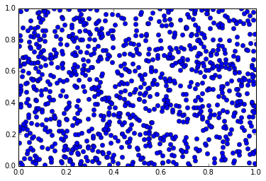

This is a hello world post written using the **IPython notebook**.

    import numpy as np
    %matplotlib inline
    import matplotlib.pyplot as plt

    x = np.random.random(1000)
    y = np.random.random(1000)
    plt.plot(x, y, 'bo');

