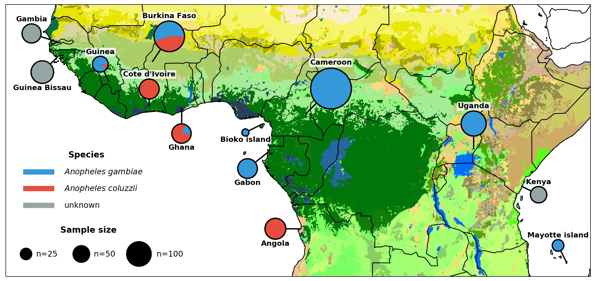
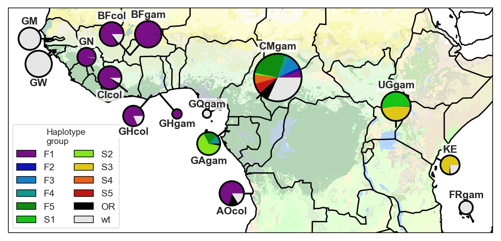
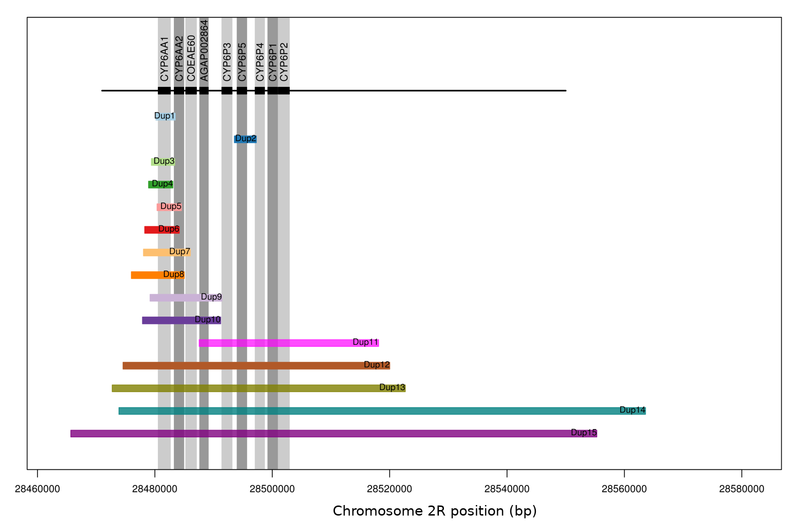
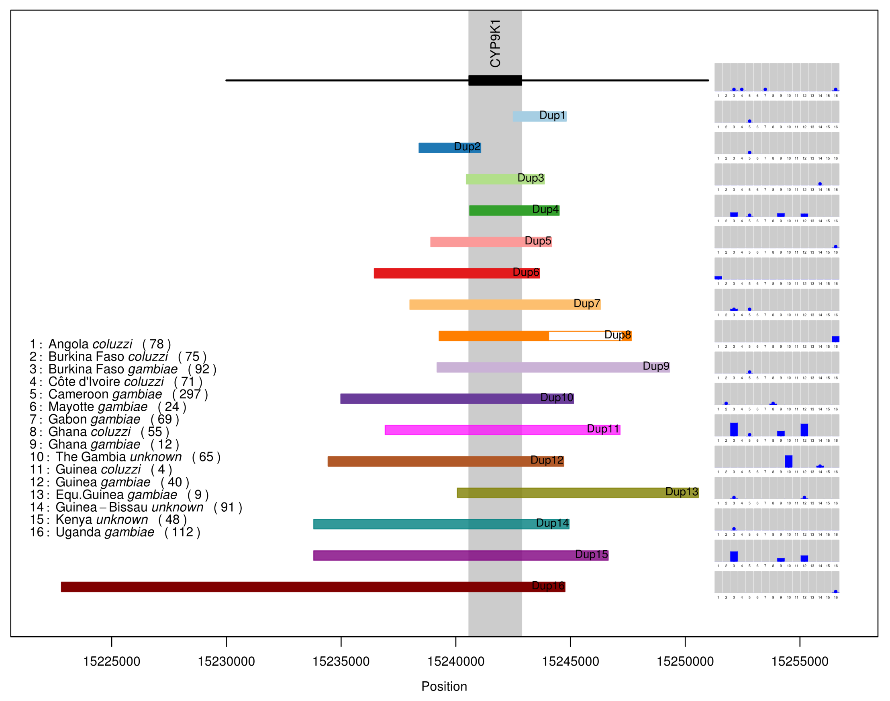
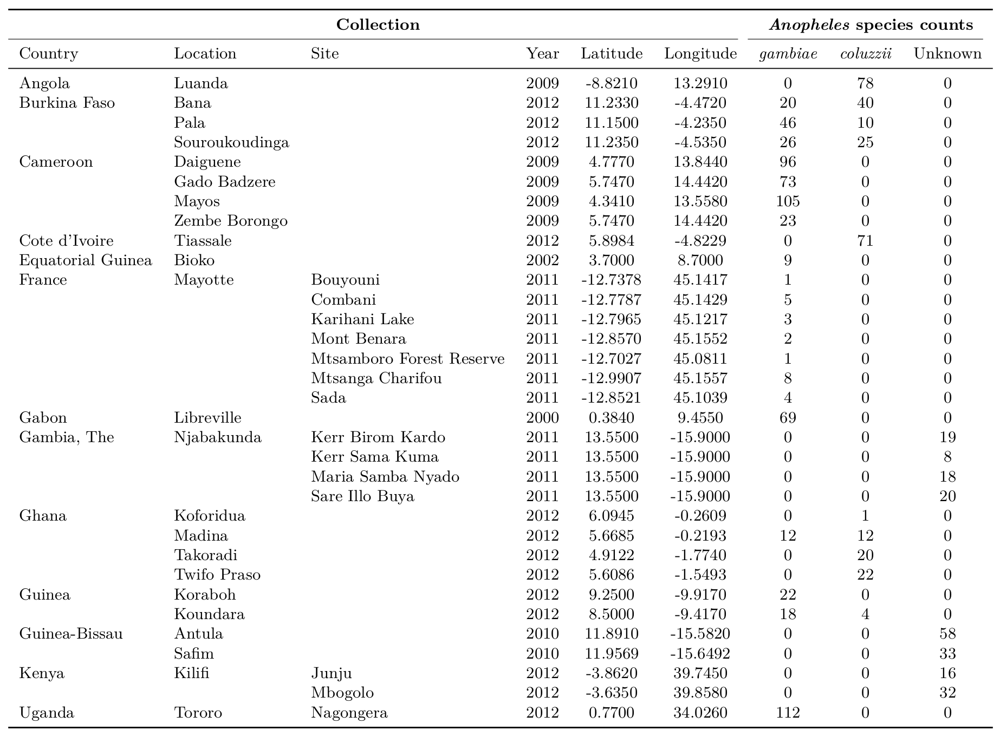

### Insights into the evolution and spread of insecticide resistance from whole-genome sequencing of 1,142 *Anopheles gambiae* mosquitoes from 13 countries

Alistair Miles ([@alimanfoo](https://github.com/alimanfoo)) - PAMCA 2019

<small>[The *Anopheles gambiae* 1000 Genomes Consortium](http://www.malariagen.net/ag1000g)</small>

<small>These slides: [alimanfoo.github.io/slides/pamca2019/](https://alimanfoo.github.io/slides/pamca2019/)</small>

====

### *Anopheles gambiae* 1000 Genomes Project - phase 2

<small>**Caution**: one location per country; one time point per country; different countries sampled in different years; nothing more recent than 2012.</small>

===

### Methods

* Collect mosquitoes
* Extract DNA
* Whole-genome sequencing (Illumina Hi-Seq)
* Align sequence reads
* Identify genetic differences

===

### Single nucleotide polymorphisms (SNPs)

@@TODO SNP diagram

<!-- explain effect - protein change -->

===

### Copy number variants (CNVs)

@@TODO CNV diagram

<!-- explain effect - increase expression -->

====

### Outline

* Pyrethroid resistance
 * Target-site resistance
 * Metabolic resistance
* Organophosphate resistance
* Emerging/unknown resistance

====

### Pyrethroid target-site resistance

* Pyrethroids bind to the voltage-gated sodium channel (VGSC) protein
* SNPs in the VGSC gene can change the protein and cause resistance
* Known resistance SNPs
 * L995F ("*kdr* west")
 * L995S ("*kdr* east")
 * L995F + N1570Y

===

### Prevalence of *kdr* L995F

* *An. gambiae*: Cameroon (53%), Ghana (100%), Burkina Faso (100%), Guinea (100%), Gabon (33%)
* *An. coluzzii*: Angola (84%), Ghana (82%), Burkina Faso (85%), Cote d'Ivoire (91%), Guinea (88%)

===

### Prevalence of *kdr* L995S

* *An. gambiae*: Cameroon (16%), Gabon (67%), Uganda (100%), Kenya (76%)

===

### Prevalence of *kdr* L995F + N1570Y

* *An. gambiae*: Cameroon (6%), Ghana (17%), Burkina Faso (21%), Guinea (9%)
* *An. coluzzii*: Burkina Faso (27%)

===

### New resistance SNPs?

* L995F + R254K
* L995F + D466H + I1940T
* L995F + T791M + A1746S
* L995F + E1597G
* L995F + K1603T
* L995F + V1853I
* L995F + I1868T
* L995F + P1874S
* L995F + P1874L
* L995F + F1920S
* L995F + A1934V
* V402L + I1527T

<small>There is **much** more to pyrethroid target-site resistance than just *kdr*!</small>

===

### Spread of target-site resistance

<small>Use genetic backgrounds (haplotypes) to infer outbreaks of resistance. E.g., "F1" is a major outbreak driven by *kdr* L995F, has spread throughout West and Central Africa, and spread between *An. gambiae* and *An. coluzzii*.</small> 

===

@@TODO link to Vgsc preprint

====

### Pyrethroid metabolic resistance

* Pyrethroids are metablised by cytochrome P450 enzyomes (a.k.a. mixed-function oxidases; MFOs)
* Increased expression of certain P450s causes resistance
* Genetic basis of metabolic resistance unknown
 * (Although long suspected that CNVs play a role)
* Important because PBO LLINs designed to neutralise P450s

===

### CNVs at *Cyp9p/aa*

===

### CNVs at *Cyp9k1*

===

### Prevalence and spread of metabolic resistance (Cyp6p/aa)

<ul>
<li>Dup7 - <em>An. coluzzii</em>: Burkina Faso (44%), Cote d'Ivoire (32%), Ghana (5%), Guinea (75%)
<li>Dup8 - <em>An. gambiae</em>: Burkina Faso (3%), Guinea (3%)
<li>Dup10 - <em>An. coluzzii</em>: Burkina Faso (49%), Ghana (5%)
<li>Dup11 - <em>An. coluzzii</em>: Burkina Faso (41%), Ghana (5%)
<li>Dup14 - <em>An. coluzzii</em>: Burkina Faso (3%), Cote d'Ivoire (46%)
<li>Dup15 - <em>An. coluzzii</em>: Burkina Faso (1%), Cote d'Ivoire (39%)

<small>Some CNVs are very common and spreading, especially in West African *An. coluzzii*.</small>

===

@@TODO link to CNV paper and blog post

====

### Pyrethroid resistance mechanisms

<small>Possible to combine data on target-site and metabolic resistance, to show which molecular mechanisms are present in which populations.</small>

====

@@TODO acknowledgments

====

### Extra slides

===

