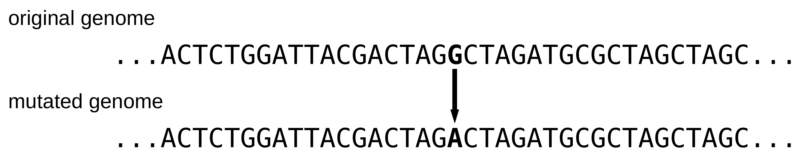
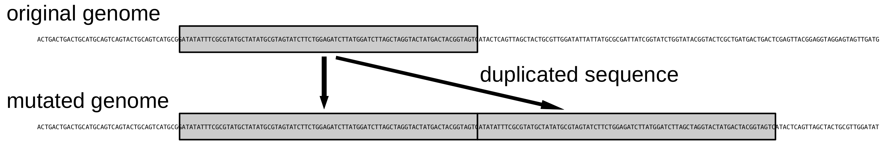
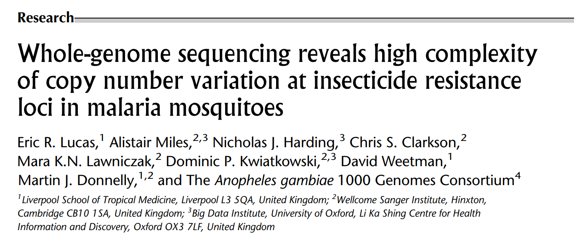
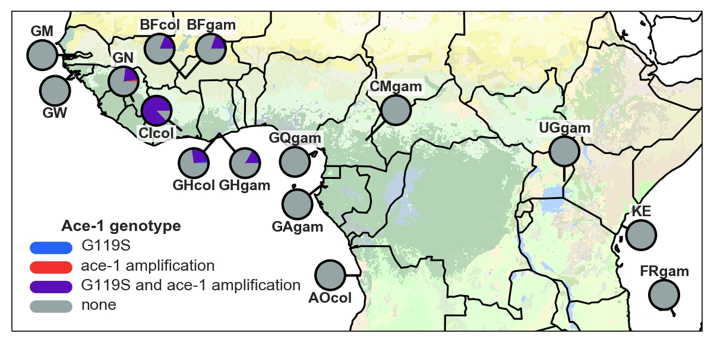

### Insights into the evolution and spread of insecticide resistance from whole-genome sequencing of 1,142 *Anopheles gambiae* mosquitoes from 13 countries

Alistair Miles ([@alimanfoo](https://github.com/alimanfoo)) - PAMCA 2019

[The *Anopheles gambiae* 1000 Genomes Consortium](http://www.malariagen.net/ag1000g)

<small>These slides: [alimanfoo.github.io/slides/pamca2019/](https://alimanfoo.github.io/slides/pamca2019/)</small>

====

### *Anopheles gambiae* 1000 Genomes Project - phase 2

<small>N.B., one location per country; one time point per country; different countries sampled in different years; nothing more recent than 2012.</small>

===

### Methods

* Collect mosquitoes
* Extract DNA
* Whole-genome sequencing (Illumina Hi-Seq)
* Align sequence reads
* Identify genetic differences

===

### Single nucleotide polymorphisms (SNPs)

If a SNP occurs in a gene coding sequence, it may change the encoded amino acid sequence, which may change the behaviour of the protein.

===

### Copy number variants (CNVs)

If a CNV spans a gene, then the gene will occur twice (two copies) in the mutated genome. More gene copies may mean more protein is produced.

===

### Ag1000G phase 2 data resource

Across the whole genome, we find:
* 57,837,885 SNPs
* 31,335 CNVs

====

### Outline

* Pyrethroid resistance
 * Metabolic resistance
 * Target-site resistance
 * Combined view
* Organophosphate resistance
* Emerging/unknown resistance
* Translation to surveillance

====

### Pyrethroid metabolic resistance

* Pyrethroids are metabolised by cytochrome P450 (CYP) enzymes (a.k.a. mixed-function oxidases; MFOs)
* Increased expression of certain CYP genes causes resistance
* Genetic variants causing metabolic resistance **not previously known** in *An. gambiae* complex
 * Although long suspected that CNVs play a role
 * More gene copies &rarr; more protein &rarr; faster metabolism &rarr; resistance
* N.B., PBO LLINs work by inhibiting CYPs

===

### CNV hot spots

Genome locations where we find a lot of CNVs at high population frequency:

* CYP6P/AA (cytochrome P450 gene cluster)
* CYP9K1 (cytochrome P450 gene)
* GSTE (glutathione S-transferase gene)

===

### CNVs at CYP6P/AA

===

### CNVs at CYP9K1

===

### Prevalence and spread of CYP6P/AA CNVs

* Dup1 - <em>An. gambiae</em>: Uganda (58%)
* Dup7 - <em>An. coluzzii</em>: Burkina Faso (44%), Cote d'Ivoire (32%), Ghana (5%), Guinea (75%)
* Dup10 - <em>An. coluzzii</em>: Burkina Faso (49%), Ghana (5%)
* Dup11 - <em>An. coluzzii</em>: Burkina Faso (41%), Ghana (5%)
* Dup14 - <em>An. coluzzii</em>: Burkina Faso (3%), Cote d'Ivoire (46%)
* Dup15 - <em>An. coluzzii</em>: Burkina Faso (1%), Cote d'Ivoire (39%)

Some CNVs are very common and spreading, especially in West African *An. coluzzii*.

===

### Surveillance of metabolic resistance

* Next-generation LLINs: how many, what type, where to put them?
* Which populations have CYP-mediated metabolic resistance?
* CNVs are likely to be a good marker of CYP-mediated metabolic resistance 
* Although, N.B., there could be other genetic variants causing metabolic resistance

===

See also "Insecticide resistance gene copy number variation in malaria mosquitoes" on <a href="http://alimanfoo.github.io/">alimanfoo.github.io</a>

====

### Pyrethroid target-site resistance

* Pyrethroids bind to the voltage-gated sodium channel (VGSC) protein
* SNPs in the VGSC gene can change the protein and cause resistance
* Known resistance SNPs
 * L995F ("*kdr* west")
 * L995S ("*kdr* east")
 * L995F + N1570Y

===

### Prevalence of *kdr* L995F

* *An. gambiae*: Cameroon (53%), Ghana (100%), Burkina Faso (100%), Guinea (100%), Gabon (33%)
* *An. coluzzii*: Angola (84%), Ghana (82%), Burkina Faso (85%), Cote d'Ivoire (91%), Guinea (88%)

===

### Prevalence of *kdr* L995S

* *An. gambiae*: Cameroon (16%), Gabon (67%), Uganda (100%), Kenya (76%)

===

### Prevalence of *kdr* L995F + N1570Y

* *An. gambiae*: Cameroon (6%), Ghana (17%), Burkina Faso (21%), Guinea (9%)
* *An. coluzzii*: Burkina Faso (27%)

===

### New resistance SNPs?

* L995F + R254K
* L995F + D466H + I1940T
* L995F + T791M + A1746S
* L995F + E1597G
* L995F + K1603T
* L995F + V1853I
* L995F + I1868T
* L995F + P1874S
* L995F + P1874L
* L995F + F1920S
* L995F + A1934V
* V402L + I1527T

<small>There is **much** more to pyrethroid target-site resistance than just *kdr*!</small>

===

### Spread of target-site resistance

<small>Use genetic backgrounds (haplotypes) to infer outbreaks of resistance. E.g., "F1" is a major outbreak driven by *kdr* L995F, has spread throughout West and Central Africa, and spread between *An. gambiae* and *An. coluzzii*.</small> 

===

<small>(Will be updated with new data from Ag1000G phase 2 soon.)</small>

====

### Pyrethroid resistance mechanisms

<small>Possible to combine data on target-site and metabolic resistance, to show which molecular mechanisms are present in which populations.</small>

====

### Organophosphate resistance

* Organophosphates bind to acetylcholinesterase (ACE1) enzyme
* Genetic changes in ACE1 gene associated with resistance
 * SNPs (G119S) and CNVs

===

### Prevalence of ACE1 SNPs and CNVs

<small>G119S and CNV always found together. Spreading in West Africa, both *An. gambiae* and *An. coluzzii*.</small>

====

### Unknown/emerging resistance mechanisms

* GSTE CNVs - major role in metabolic resistance of pyrethroids?
* Carboxylesterases - role in organophosphate resistance?
* Emerging signals at other genes in acetylcholine regulation pathway?

====

### Translation to surveillance

* Use cases in insecticide resistance management
 * Deployment of next-generation LLINs
 * Rotation of next-generation IRS
* Need recent samples
* Need better geographical coverage
* Need more species (e.g., *An. arabiensis*, *An. funestus*)
* Scale up whole-genome sequencing at genome centres
 * N.B., Wellcome Sanger Institute can now sequence 10,000 mosquitoes/year
* Scale up targeted (amplicon) sequencing at local/region labs

====

### Acknowledgments

<small>This work was carried out by the <em>Anopheles gambiae</em> 1000 Genomes Consortium:</small>

<small>Thank you to the staff of the Wellcome Sanger Institute Sample
Logistics, Sequencing and Informatics facilities.</small>
<small>Thank you to Wellcome Trust, MRC UK, DFID UK, NIH, NIAID, Bill and Melinda Gates Foundation.</small>

====

### Extra slides

===

